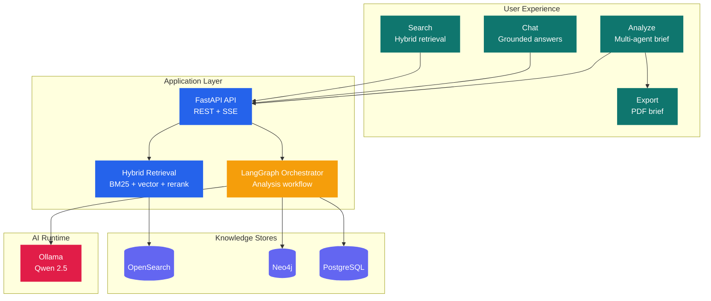
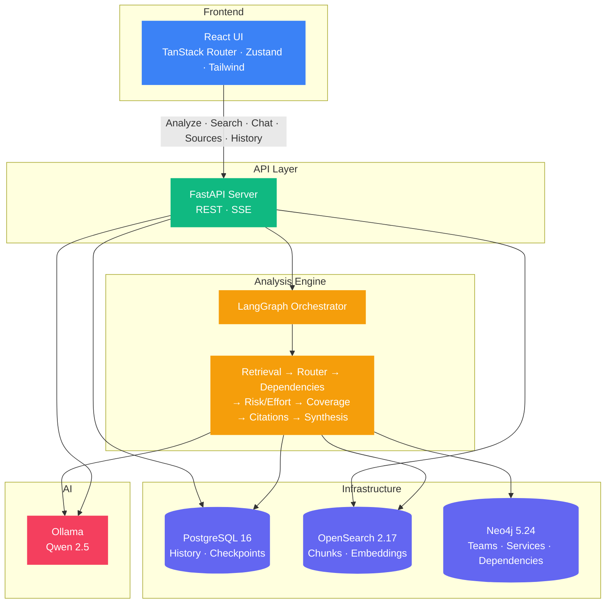

# PRISM

**Platform-aware Requirement Intelligence and Service Mapping**

PRISM turns a product or platform requirement into a cross-team analysis brief grounded in your internal documentation. It also ships with a search experience, a retrieval-grounded chat assistant, a source catalog, analysis history, and PDF export for completed briefs.



## What PRISM Does

- Analyzes a structured requirement brief, not just a single sentence
- Recommends a primary owning team and supporting teams
- Identifies services in scope and related dependencies
- Surfaces risks, effort, blockers, evidence quality, and unsupported claims
- Streams live agent progress while the analysis is running
- Lets users search the knowledge base with filters and pagination
- Supports grounded chat with source citations and chunk previews
- Exports completed analyses as readable PDFs

## Product Surfaces

| Surface | What it does |
|---|---|
| Dashboard | Health, recent analyses, teams, conflicts, quick entry points |
| Analyze | Structured requirement intake and live multi-agent analysis |
| Search | Hybrid retrieval over the knowledge base with filters and pagination |
| Chat | Retrieval-grounded Q&A with source references and citation previews |
| Sources | Connected source inventory and ingestion controls |
| History | Past analysis runs with status and deletion |

## Quickstart

```bash
./run.sh
```

This single command:

1. Installs backend dependencies with `uv`
2. Installs frontend dependencies with `bun`
3. Starts infrastructure with Docker Compose
4. Configures OpenSearch and Neo4j
5. Generates seed data on first run
6. Ingests documents into OpenSearch and Neo4j
7. Starts the API on `http://localhost:8000`
8. Starts the UI on `http://localhost:5173`

### Prerequisites

- [uv](https://docs.astral.sh/uv/)
- [bun](https://bun.sh/)
- [Docker](https://www.docker.com/)
- [Ollama](https://ollama.com/) for local LLM-backed features

## Analysis Input

PRISM accepts a structured analysis brief:

```json
{
  "requirement": "Add MFA to customer portal",
  "business_goal": "Reduce account takeover risk before enterprise rollout",
  "context": "Portal already supports email/password login and audit logging",
  "constraints": "Do not break existing mobile login flow",
  "known_teams": "Platform Team, Security Team",
  "known_services": "auth-service, customer-portal",
  "questions_to_answer": "Who should own this work? What dependencies could block it?"
}
```

## Architecture

PRISM has two main runtime paths:

- Analysis: FastAPI -> LangGraph orchestrator -> retrieval + specialist agents -> persisted report
- Search and chat: FastAPI -> hybrid retrieval -> search results or grounded chat answer



See [docs/architecture.md](docs/architecture.md) for detailed diagrams and runtime notes.

## Documentation

| Document | Description |
|---|---|
| [Architecture](docs/architecture.md) | Topology, runtime flows, data stores, product surfaces |
| [Data Flow](docs/data-flow.md) | Ingestion, retrieval, entity extraction, search/chat flow |
| [Agents](docs/agents.md) | Agent responsibilities, orchestration, state, degradation |
| [API Reference](docs/api.md) | Analysis, search, graph, sources, history, chat endpoints |
| [Deployment](docs/deployment.md) | Docker Compose setup, ports, env vars, migration notes |
| [Development](docs/development.md) | Local setup, tests, project structure, extension points |

## Tech Stack

| Layer | Technology |
|---|---|
| LLM | Qwen 2.5 7B via Ollama |
| Search | OpenSearch 2.17 hybrid retrieval |
| Knowledge Graph | Neo4j 5.24 |
| Persistence | PostgreSQL 16 |
| Agent Framework | LangGraph with PostgreSQL checkpointing |
| Embeddings | `sentence-transformers/all-MiniLM-L6-v2` |
| Re-ranking | `cross-encoder/ms-marco-MiniLM-L-6-v2` |
| Backend | FastAPI + Python 3.12 |
| Frontend | React 18.3 + TypeScript + Tailwind CSS + TanStack Router |
| Export | jsPDF + jspdf-autotable |

## Project Structure

```text
prism/
├── run.sh
├── docker-compose.yml
├── backend/
│   ├── src/
│   │   ├── agents/
│   │   ├── api/
│   │   ├── connectors/
│   │   ├── ingestion/
│   │   ├── models/
│   │   ├── retrieval/
│   │   ├── db.py
│   │   └── ollama_client.py
│   └── tests/
├── ui/
│   └── src/
│       ├── components/
│       ├── hooks/
│       ├── lib/
│       ├── routes/
│       └── stores/
├── scripts/
├── data/
└── docs/
```

## Verification

Current local verification targets:

- Backend test suite: `45` tests
- Frontend build: `tsc -b && vite build`

## License

Internal POC. Not licensed for distribution.
