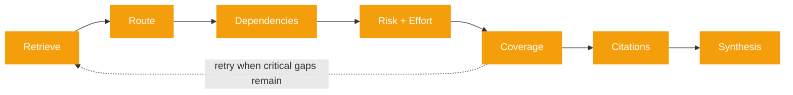
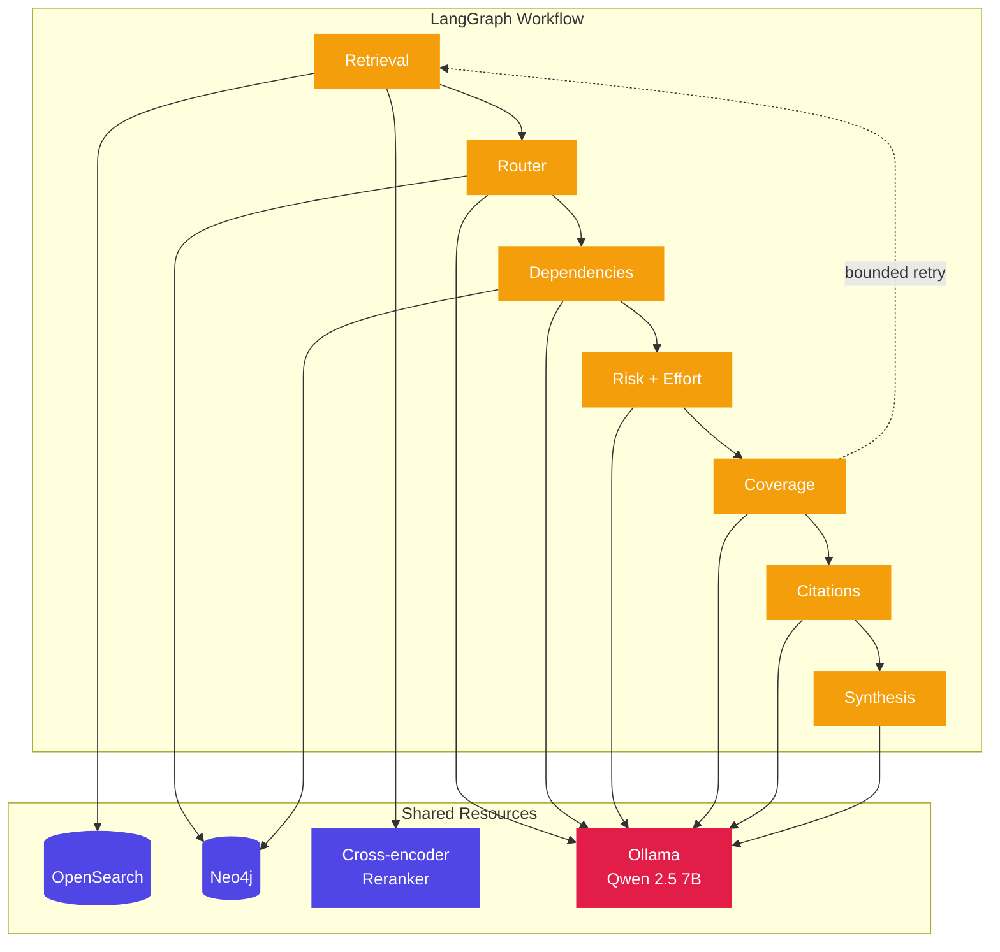
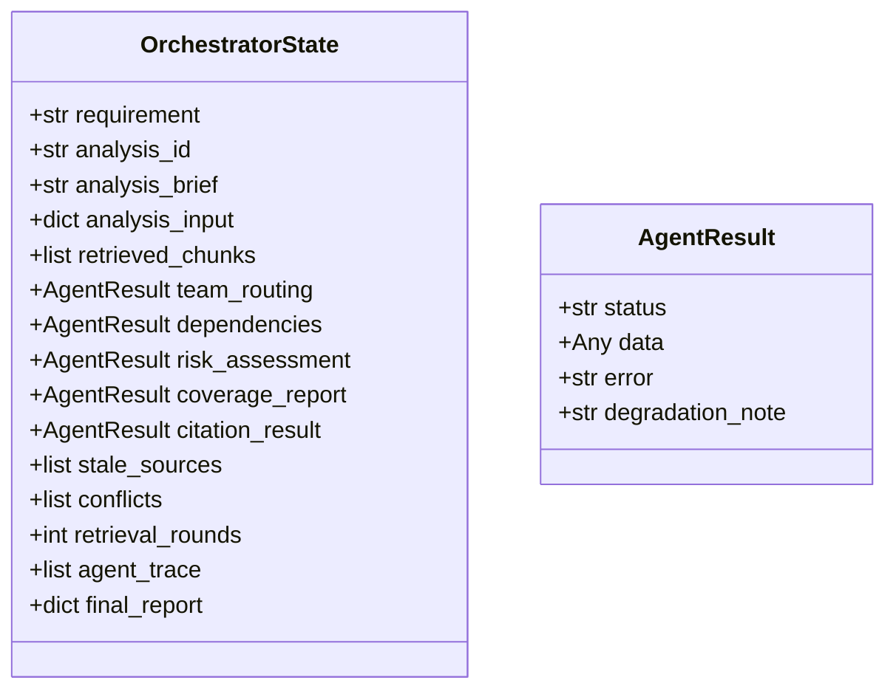
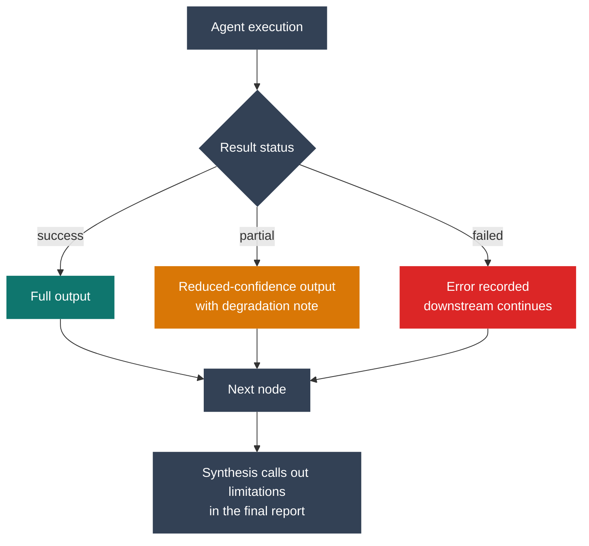

# Agent System

## Orchestrator Overview

PRISM runs a LangGraph workflow with PostgreSQL checkpointing. The pipeline is mostly linear, with one bounded retrieval loop triggered by the coverage agent when critical evidence gaps remain.

## Agent Roster

## Agent Responsibilities

### Retrieval

Purpose:
- retrieve the most relevant chunks for the requirement brief
- expand the query when LLM support is available
- provide a shared evidence set to downstream agents

Key behaviors:
- hybrid retrieval over OpenSearch
- de-duplication by canonical chunk id
- graceful degradation if evidence is sparse

### Router

Purpose:
- recommend a primary owner and supporting teams
- identify the **services in scope** for the requirement

Key behaviors:
- reranks routing-relevant chunks
- queries Neo4j for teams, service ownership, and conflicts
- uses the LLM to score candidate teams and explain the recommendation

Notes:
- the UI presents router services as **Services In Scope**
- ownership conflicts are preserved and surfaced instead of silently resolved

### Dependencies

Purpose:
- map service-to-service relationships around the work

Key behaviors:
- prefers router-identified services in scope
- falls back to chunk service hints only when routing did not identify services
- traverses Neo4j dependencies and classifies edges

Output semantics:
- `blocking`: relationships that are likely to stop or gate the work
- `impacted`: non-blocking edges affected by the work
- `informational`: contextual edges that help explain the system

UI labels:
- `impacted` is rendered as **Non-Blocking Dependencies**
- `informational` is rendered as **Contextual Dependencies**

### Risk + Effort

Purpose:
- assess implementation risk and estimate effort

Key behaviors:
- reranks risk-relevant evidence
- detects stale documents
- generates categorized risk items and staffing/effort ranges

Risk categories:
- `technical_complexity`
- `dependency_risk`
- `knowledge_gaps`
- `integration_risk`
- `data_risk`
- `security_risk`

### Coverage

Purpose:
- determine whether the analysis is sufficiently supported by documentation

Key behaviors:
- checks whether identified services have supporting docs
- tracks critical gaps and stale sources
- can trigger one or more bounded retrieval retries

### Citations

Purpose:
- verify claims and surface unsupported conclusions

Key behaviors:
- compiles claims from upstream agent outputs
- ties verified claims to supporting documents and excerpts
- records unsupported claims and stale-source warnings

### Synthesis

Purpose:
- produce the final business-facing report

Key behaviors:
- combines all agent outputs into the executive summary and narratives
- includes recommendations, caveats, data-quality notes, verification results, and impact matrix rows

## Shared State

The orchestrator passes checkpoint-safe state between nodes. Non-serializable runtime values, such as step callbacks, are kept out of checkpointed state.

`AgentResult.status` is one of:

- `success`
- `partial`
- `failed`

## Graceful Degradation

## Prompting Pattern

Every specialist agent follows the same general structure:

1. system prompt defining role and hard rules
2. structured user prompt with requirement brief, retrieved chunks, and graph context
3. JSON schema constrained output validated with Pydantic

If parsing or validation fails, the orchestrator still returns a structurally valid partial result so the overall run can continue.
