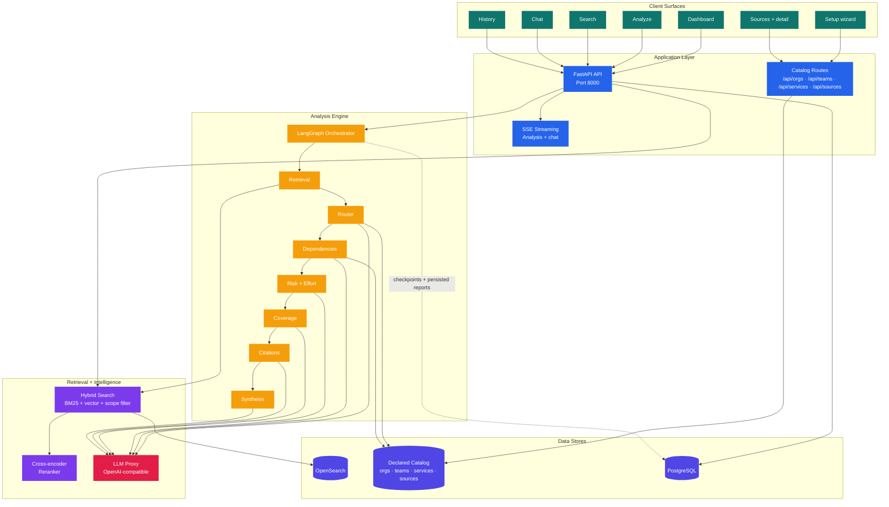
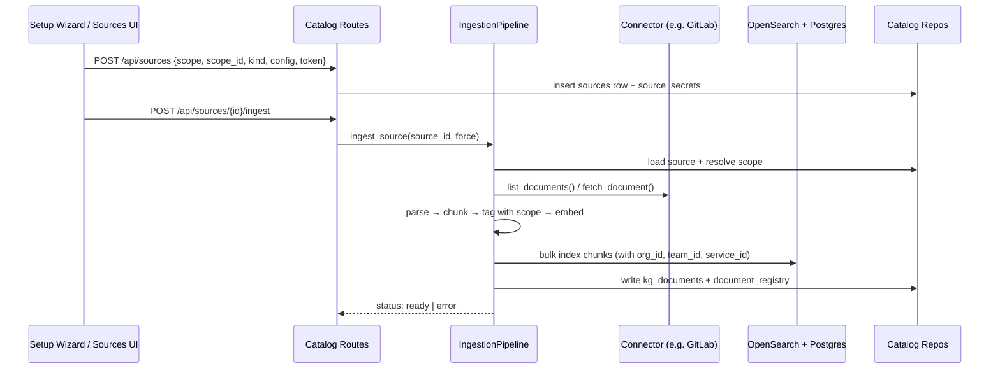
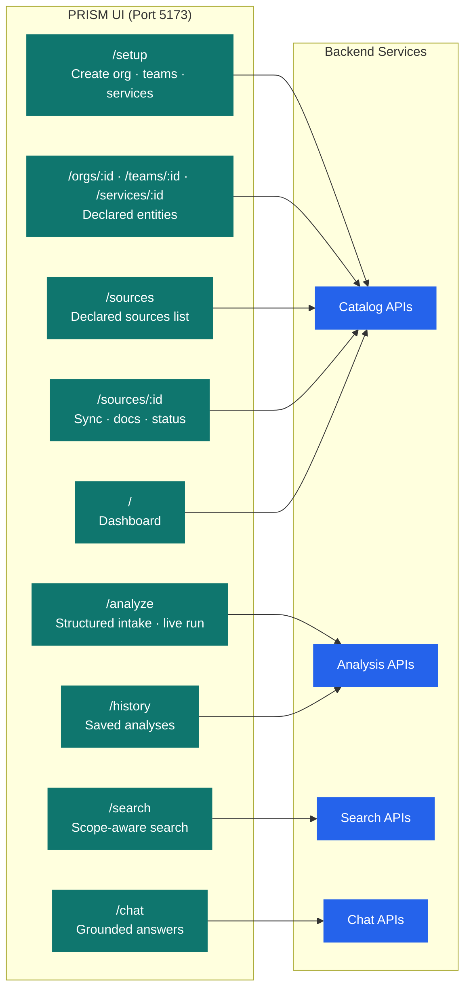
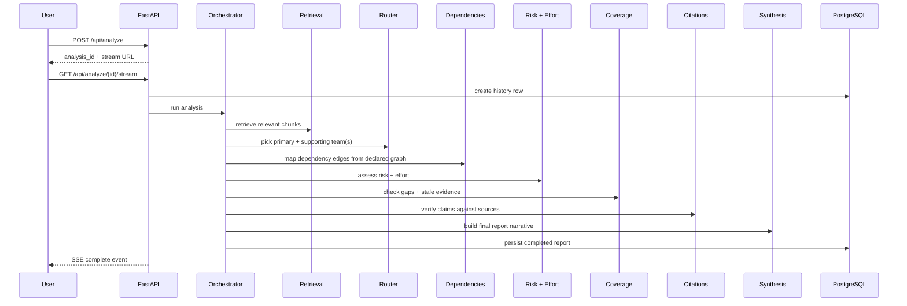
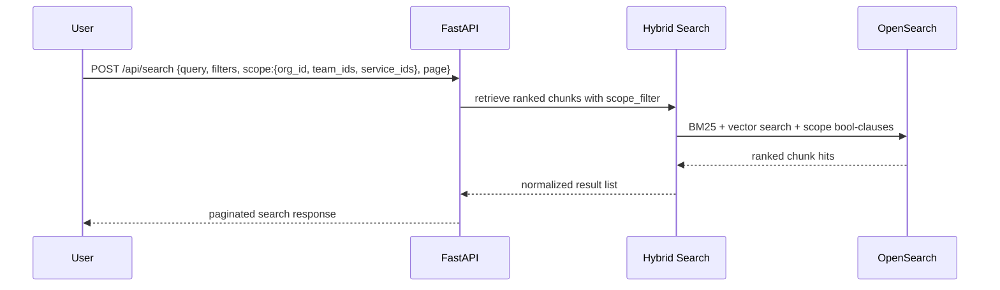

# Architecture

## System Topology

PRISM has two primary product paths:

- **Analysis** for long-running, multi-agent requirement briefs
- **Search and chat** for direct retrieval over the same knowledge base

Both run on top of the **declared catalog** (organizations → teams → services)
and the **declared sources** attached to those entities. Ingested documents
carry a scope pointer `(org_id, team_id, service_id)` directly — no inference.



## The Declarative Ownership Model

PRISM replaces regex-inferred ownership with an explicit hierarchy. See
[plan.md](../plan.md) for the design rationale.

```
Organization
 ├── Sources (scope = org)              ← visible to every team in the org
 └── Teams
      ├── Sources (scope = team)        ← visible only to this team's analyses
      └── Services
           └── Sources (scope = service) ← narrowest; the service's own docs
```

Every ingested document inherits the `(org_id, team_id, service_id)` triple
from its source. A chunk's scope is non-negotiable: it is what was declared
at ingest time, not what the text might have implied.

### Retrieval filter semantics

For an analysis routed to **Team X, Service Y, Org Z**, the filter is:

```sql
WHERE org_id = Z
  AND (team_id    IS NULL OR team_id    = X)
  AND (service_id IS NULL OR service_id = Y)
```

Org-scoped chunks always match. Team chunks match only when their team is
in scope. Service chunks match only their own service. The filter pushes
down to OpenSearch as `bool` clauses — no scoring impact, huge precision
win.

## Catalog Schema

```mermaid
erDiagram
    ORGANIZATIONS ||--o{ TEAMS : has
    ORGANIZATIONS ||--o{ SOURCES : "scope=org"
    TEAMS ||--o{ SERVICES : has
    TEAMS ||--o{ SOURCES : "scope=team"
    SERVICES ||--o{ SOURCES : "scope=service"
    SOURCES ||--o{ KG_DOCUMENTS : ingests
    SOURCES ||--o{ DOCUMENT_REGISTRY : tracks
    SOURCES ||--|| SOURCE_SECRETS : has
    SERVICES ||--o{ KG_DEPENDENCIES : from
    SERVICES ||--o{ KG_DEPENDENCIES : to
    SERVICES ||--o{ KG_PENDING_DEPENDENCIES : from

    ORGANIZATIONS {
        uuid id PK
        text name UK
    }
    TEAMS {
        uuid id PK
        uuid org_id FK
        text name
    }
    SERVICES {
        uuid id PK
        uuid team_id FK
        text name
        text repo_url
    }
    SOURCES {
        uuid id PK
        uuid org_id FK "nullable; exactly-one scope via CHECK"
        uuid team_id FK "nullable"
        uuid service_id FK "nullable"
        text kind
        text status
        jsonb config
    }
```

Every source row satisfies `(org_id IS NOT NULL) + (team_id IS NOT NULL) +
(service_id IS NOT NULL) = 1` — enforced with a CHECK constraint in the
`sources` table.

### Documents and dependencies

- `kg_documents` holds denormalized `(source_id, org_id, team_id, service_id)`
  plus title/path/platform. Dropping a source cascades these away.
- `kg_dependencies` carries two edge flavours in one table. **Catalog edges**
  link `from_service_id` to `to_service_id` (both UUIDs in `services`).
  **External edges** set `to_service_id` NULL and use `to_external_name` +
  `to_external_description` to capture targets outside the declared catalog
  (Stripe, Auth0, an upstream team's API). A CHECK constraint enforces XOR;
  external uniqueness is case-insensitive via a function-based unique index
  on `(from_service_id, lower(to_external_name))`. Rows are user-managed via
  the service detail page — the ingestion pipeline does not write to this
  table. Edges carry `source = 'manual'` so any future automated origin can
  be distinguished. The org graph filters external rows out because the
  visualization only renders declared catalog nodes.
- `document_registry` keeps content-hash idempotency and gains `source_id`.

## Ingestion Flow



## Product Surfaces



## Runtime Flows

### 1. Analysis Flow



### 2. Search Flow (scope-aware)



## Data Responsibilities

| Store | Role |
|---|---|
| **Catalog tables** (`organizations`, `teams`, `services`, `sources`) | The authoritative declared ownership graph. All other writes reference these by UUID FK. |
| **OpenSearch** | Chunk storage, embeddings, hybrid retrieval, source preview lookup. Chunks carry `source_id`, `org_id`, `team_id`, `service_id` for filter pushdown. |
| **PostgreSQL / kg_documents** | One row per ingested document with scope pointers + source pointer. |
| **PostgreSQL / kg_dependencies** | User-managed service-to-service edges by UUID. Written by the service detail page UI, not by ingestion. |
| **PostgreSQL / document_registry** | Idempotency (content hash) + which source ingested each doc. |
| **PostgreSQL / analyses** | Analysis history + LangGraph checkpoints. Unchanged by Phase 1. |
| **Redis** | Present in local Docker stack as auxiliary infrastructure. |

## Deployment View

The default local stack uses Docker for infrastructure, `uvicorn` for the API
on `:8000`, and Vite for the UI on `:5173`. First boot drops the user at
`/setup` because the catalog starts empty. See [deployment.md](deployment.md)
for ports, env vars, and container details.
