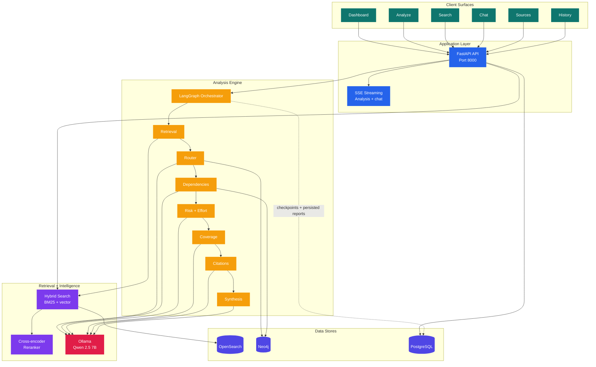
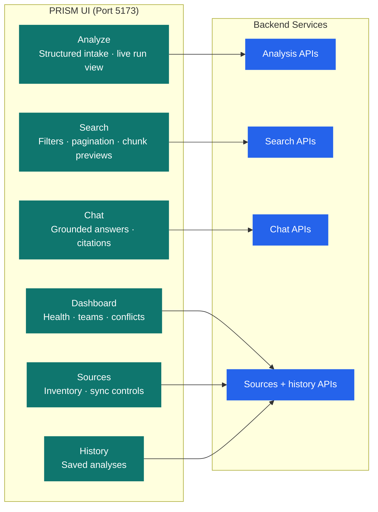
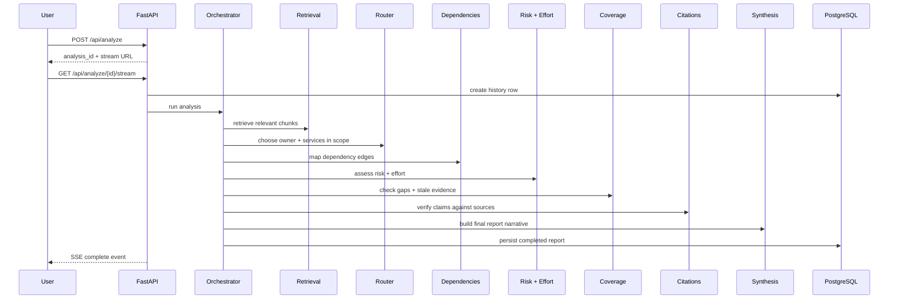
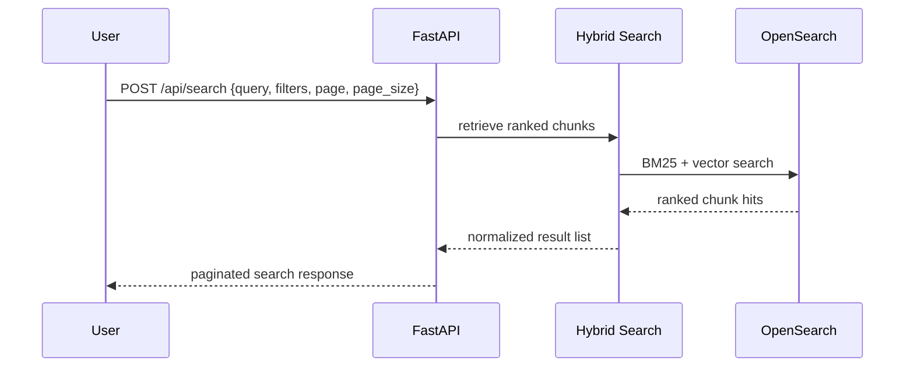
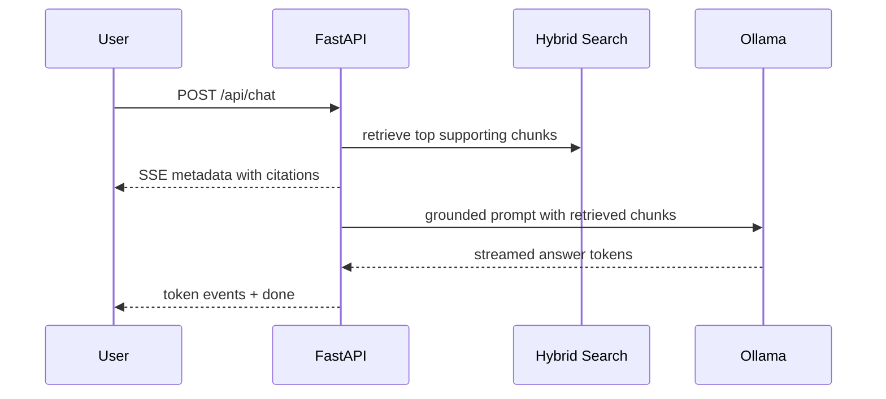
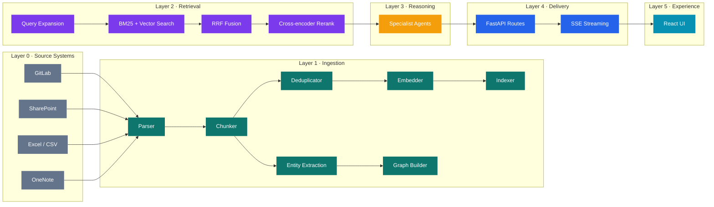
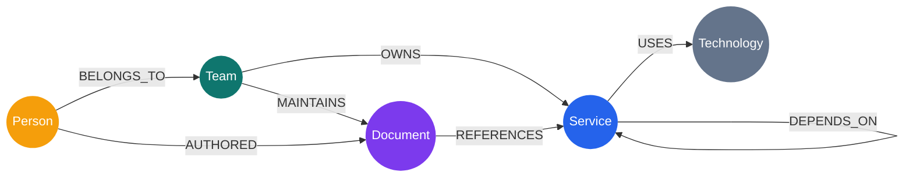

# Architecture

## System Topology

PRISM has two primary product paths:

- **Analysis** for long-running, multi-agent requirement briefs
- **Search and chat** for direct retrieval over the same knowledge base

## Product Surfaces

## Runtime Flows

### 1. Analysis Flow

### 2. Search Flow

### 3. Chat Flow

## Layer Breakdown

## Data Responsibilities

| Store | Role |
|---|---|
| OpenSearch | Chunk storage, embeddings, hybrid retrieval, source preview lookup |
| Neo4j | Teams, services, ownership, dependency relationships, conflicts |
| PostgreSQL | Document registry, analysis history, LangGraph checkpoints |
| Redis | Present in local Docker stack as auxiliary infrastructure, not part of the main request path documented above |

## Knowledge Graph Schema

### Core Node Properties

| Node | Typical properties |
|---|---|
| Team | `name`, `description`, `contact` |
| Service | `name`, `team_owner`, `status`, `repo_url` |
| Document | `id`, `title`, `path`, `platform`, `last_modified` |
| Person | `name`, `email`, `team` |
| Technology | `name`, `version` |

### Core Edge Properties

| Edge | Typical properties |
|---|---|
| `OWNS` | `confidence`, `source`, `last_updated` |
| `DEPENDS_ON` | `source`, `confidence`, `reason` |
| `MAINTAINS` | `source` |

## Deployment View

The default local stack uses Docker for infrastructure, `uvicorn` for the API on `:8000`, and Vite for the UI on `:5173`. See [deployment.md](deployment.md) for ports, env vars, and container details.
