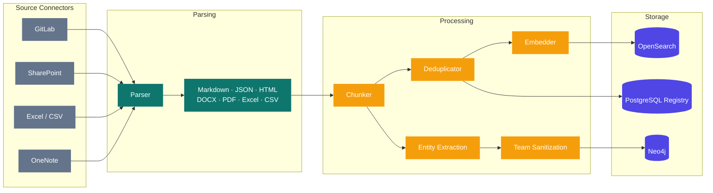
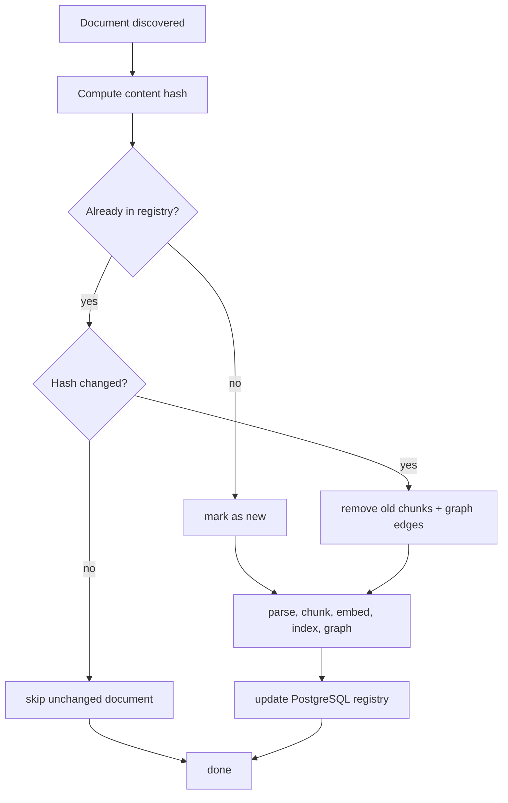
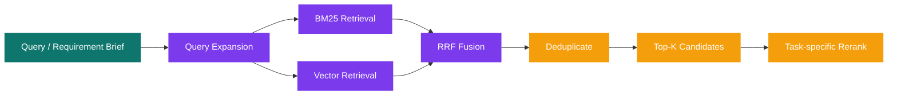
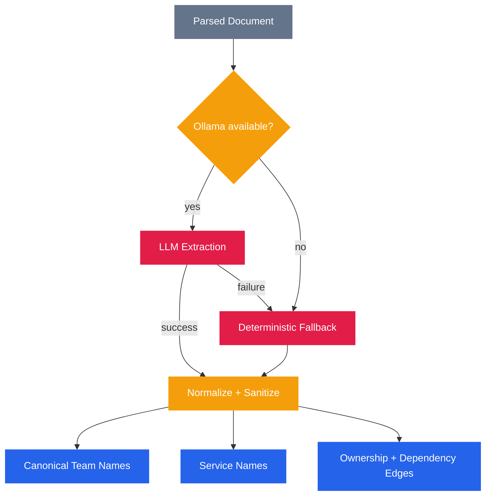
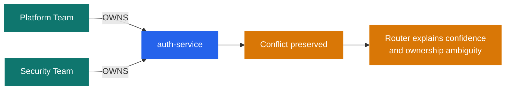

# Data Flow

## Ingestion Pipeline



## Incremental Ingestion



## Chunk Metadata

Each chunk indexed in OpenSearch carries document and entity hints used by search, chat, and agents.

```text
chunk_id
document_id
content
embedding
source_platform
source_path
source_url
document_title
section_heading
team_hint
service_hint
doc_type
last_modified
author
chunk_index
total_chunks
canonical_chunk_id
```

## Retrieval Pipeline

PRISM uses the same hybrid retrieval engine for:

- analysis retrieval
- manual search
- chat grounding
- chat source preview fallback



### Analysis Retrieval

- query can be built from `requirement`, `business_goal`, `context`, `constraints`, `known_teams`, `known_services`, and `questions_to_answer`
- reranking is specialized by downstream agent
- coverage may trigger another retrieval round if critical gaps remain

### Manual Search

- uses the same hybrid engine without LLM query expansion
- supports server-side pagination
- supports filters such as `doc_type`, `team_hint`, `service_hint`, and `source_platform`

### Chat Retrieval

- retrieves a focused set of supporting chunks
- sends citation metadata to the UI before answer tokens stream
- can later fetch a source preview by `source_path` for citation popups

## Hybrid Search Details

### BM25

- exact text matching on chunk content
- good for names, ticket ids, acronyms, and explicit service references

### Vector Search

- semantic nearest-neighbor search over embeddings
- good for concept-level retrieval when wording differs

### Reciprocal Rank Fusion

```text
RRF score(doc) = sum(1 / (k + rank))
k = 60
```

### Re-ranking

Cross-encoder reranking is applied after fusion to tailor the final evidence set to the task.

| Consumer | Typical focus |
|---|---|
| Router | ownership docs, readmes, architecture, service catalogs |
| Dependencies | readmes, runbooks, architecture, issues |
| Risk + effort | incidents, issues, runbooks, meeting notes |
| Search UI | raw retrieval order, paginated |
| Chat | top supporting chunks for grounded answer generation |

## Entity Extraction

During ingestion, PRISM extracts teams, services, and relationships to populate Neo4j.



Important current behavior:

- team extraction is no longer a loose catch-all regex
- explicit team signals are normalized and sanitized to avoid junk nodes like `See Team` or `At Team`
- path-based team aliases such as `payments-team` are reconciled into canonical names like `Payments Team`

## Conflict Detection

When multiple teams claim the same service, PRISM keeps both claims and lets the analysis surface the ambiguity.


