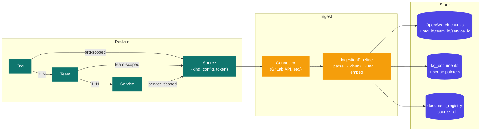
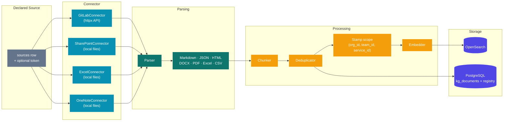
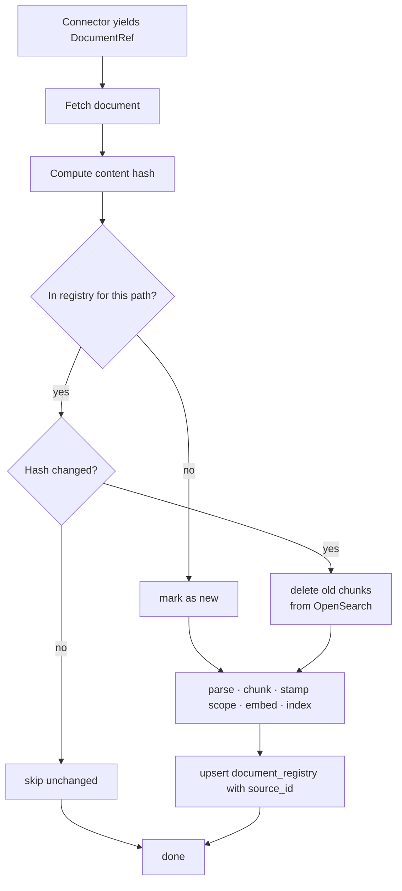
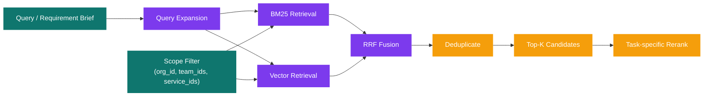

# Data Flow

## Declared sources drive everything

Every document PRISM knows about comes from a **declared source** — a row in
the `sources` table. A source is attached to exactly one scope: an org, a
team, or a service. Ingested chunks carry that scope directly so retrieval
can filter by it later.



## Ingestion Pipeline



### GitLab connector specifics

- **What gets pulled** — every `.md`, `.markdown`, `.rst` file at any depth in
  the repo, plus root-level `README.txt` / `CODEOWNERS`. Vendor directories
  (`node_modules/`, `vendor/`, `dist/`, `build/`, `.cache/`, etc.) are
  filtered out before any fetch. There is **no per-project doc cap** —
  large repos pull everything.
- **Wiki pages** — fetched via GitLab's wiki API (`/projects/:id/wikis`)
  unless the source's config sets `include_wiki: false`. Each wiki page
  becomes a `RawDocument` with `source_path = "<project>@__wiki__:wiki/<slug>"`.
- **Group ingest filtering** — when a source is a whole-group ingest
  (`group_path` instead of `project_path`), the connector adds
  `last_activity_after=<now - PRISM_GITLAB_GROUP_ACTIVE_WINDOW_DAYS>` (default
  30 days) to `/groups/:id/projects` so dormant projects never appear in the
  walk. The `gitlab_max_projects_per_source` cap (default 200) is a separate
  blast-radius guard for thousand-project groups.
- **Auth fallback** — per-source token > `PRISM_GITLAB_TOKEN` env var > no
  token (public projects only). The UI no longer collects per-source
  tokens; the wizard's project + group dropdowns hit
  `/api/gitlab/projects/search` and `/api/gitlab/groups/search` against the
  service-account token.

## Incremental Ingestion



`--force` on an ingest request (UI "Force re-index" or `ingest.py --force`)
wipes every chunk for the source first via `delete_by_source_id`, skipping
the content-hash check.

## Chunk Metadata

Each chunk indexed in OpenSearch:

```text
chunk_id
document_id
content
embedding
canonical_chunk_id

# new: declared scope pointers
source_id
org_id
team_id
service_id

# kept: connector / content attributes
source_platform
source_path
source_url
document_title
section_heading
team_hint         (legacy; from regex fallback, for backwards-compat)
service_hint      (legacy; same)
doc_type
last_modified
author
chunk_index
total_chunks
```

## Retrieval Pipeline

PRISM uses the same hybrid retrieval engine for:

- analysis retrieval (`retrieval_agent`)
- manual search (`/api/search`)
- chat grounding (`/api/chat`)
- chat source preview fallback



### Scope filter semantics

Pushed down to OpenSearch as `bool` clauses:

```
MUST    org_id = <org_id>
MUST    team_id IS NULL OR team_id IN (<team_ids...>)
MUST    service_id IS NULL OR service_id IN (<service_ids...>)
```

Org-scoped chunks always match. Team chunks match only when their team is
in scope. Service chunks match only their own service.

### Two-stage routing (analysis)

The router agent picks teams *before* the filter is applied:

1. **Routing pass** — search across the full org with no team/service
   filter; rank by relevance to identify candidate teams/services.
2. **Deep-dive pass** — re-search with `(team_id, service_id)` constraints
   from the routing pass, plus org-wide context.

## Service Dependencies

Service-to-service edges are **user-managed**. Each service detail page has a
"Dependencies" section that lists outbound edges and lets the user pick
another declared service from a team-grouped picker. No extraction from doc
text — earlier versions tried both an LLM pass and a regex fallback; both
were noisy and have been removed (see commit `bf4f680`).

```mermaid
flowchart LR
    UI[Service detail page] -->|POST /services/:id/dependencies| API[catalog_routes]
    API -->|service_repo.add_dependency| DB[(kg_dependencies)]
    API -. invalidates .-> GRAPH[/api/organization/graph]
    UI -->|DELETE /services/:id/dependencies/:to| API
    API -->|service_repo.remove_dependency| DB
```

- Edges have `source = 'manual'` so we can later distinguish hand-drawn from
  any future automated source.
- The org graph (`OrganizationGraph.tsx`) reads `dependencies` from
  `/api/organization/graph` and renders dashed `depends on` edges.
- The blast-radius graph on analyses uses the same dataset to walk
  upstream/downstream from the assigned team's services.

## Hybrid Search Details

### BM25

- exact text matching on chunk content
- good for names, ticket ids, acronyms, and explicit service references

### Vector Search

- semantic nearest-neighbor search over embeddings
- good for concept-level retrieval when wording differs

### Reciprocal Rank Fusion

```text
RRF score(doc) = sum(1 / (k + rank))
k = 60
```

### Re-ranking

Cross-encoder reranking is applied after fusion to tailor the final evidence
set to the task.

| Consumer | Typical focus |
|---|---|
| Router | readme, architecture, service catalogs |
| Dependencies | readme, runbooks, architecture, issues |
| Risk + effort | incidents, issues, runbooks, meeting notes |
| Search UI | raw retrieval order, paginated |
| Chat | top supporting chunks for grounded answer generation |

## Entity Extraction (removed)

Earlier versions ran an LLM + regex pass over each ingested doc to surface
team / service / dependency mentions. Under the declared model that
information is already explicit (orgs/teams/services are user-declared,
deps are user-managed), and the extracted output was rarely accurate
enough to be useful. The whole entity-extraction module
(`entity_extractor.py`, `team_names.py`, `kg_pending_dependencies` table)
has been removed.

The conflict-detection surface was also removed: under the declared model a
service belongs to exactly one team, so ownership conflicts can't happen at
the data layer.
