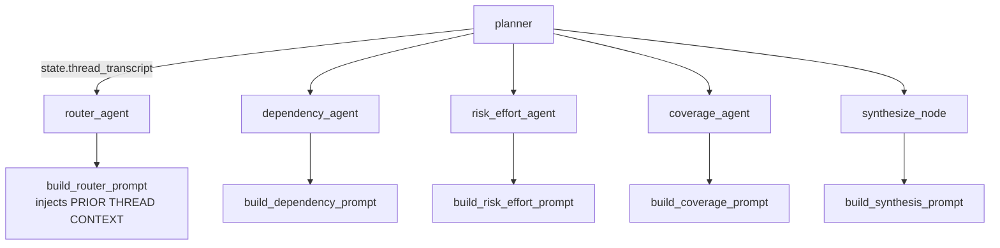

# Threading: titles, transcripts, and reruns

PRISM analyses are stored as **threads** — one analysis row per turn,
linked by `thread_id` (the root run's `analysis_id`) and
`parent_analysis_id`. This file documents the three pieces that make
multi-turn threads feel coherent: turn titles, prior-turn context, and
"rerun" handling.

## Schema

```text
analyses
  analysis_id        TEXT PK
  thread_id          TEXT       -- defaults to analysis_id (own thread)
  parent_analysis_id TEXT        -- prior turn in the thread, or NULL
  requirement        TEXT        -- raw user message for this turn
  title              TEXT        -- 4-8 word LLM headline (nullable)
  kind               TEXT        -- 'pending' | 'full' | 'chat'
  status             TEXT        -- 'running' | 'complete' | 'error'
  rolling_summary    TEXT        -- one-paragraph memo of the completed turn
  report             JSONB       -- final PRISMReport for full-mode runs
  ...
```

`kind` starts as `pending` so the UI can render a neutral
"thinking…" placeholder until the planner decides; once the planner
resolves the row flips to `full` or `chat`.

## Turn titles

Long requirements like "We want to add SSO via Okta across all our
services. Who owns this and who gets affected?" wrap awkwardly in turn
card headers. The planner kicks off a fire-and-forget LLM call that
generates a short headline:

```mermaid
flowchart LR
    P[plan_node start] -. asyncio.create_task .-> T[_generate_and_persist_title]
    T --> LLM[LLM with TURN_TITLE_SYSTEM_PROMPT<br/>4-8 word headline]
    LLM --> R[(repo.update_title)]
    R --> DB[(analyses.title)]
    UI[Thread UI polling /api/threads/:id] --> DB
```

- Model: `settings.model_bulk` (cheap).
- Failure mode: any error is logged + swallowed; UI falls back to
  `requirement` for the turn header until the title eventually lands.
- Special case: rerun-style follow-ups always get the canonical
  `"Rerun of previous analysis"` title so threads read consistently.

## Prior-turn context (transcript)

Downstream agents in a `full`-mode follow-up used to see only the
current turn's text — so a follow-up like "what are the risks?" got
analyzed without any awareness of what the thread had already covered.

The planner now computes the transcript once
(`_format_thread_context(prior_turns)`), stashes it on
`state["thread_transcript"]`, and every downstream prompt
(router, dependencies, risk, coverage, synthesis) injects a
`PRIOR THREAD CONTEXT` block above the requirement via
`prompts._thread_context_block`.



First-turn runs see an empty transcript and behave identically to the
non-threaded case.

## Rerun rewrites

When the user types something like "can you run the analysis again?",
the planner spots it as a meta-command. The `PlanOutput` schema carries
an optional `effective_requirement` field:

```python
class PlanOutput(BaseModel):
    mode: PlanMode = "full"
    question_type: QuestionType
    agents_to_run: list[PlanAgentKey]
    reasoning: str = ""
    effective_requirement: str | None = None
```

When set, the orchestrator swaps it into state before any downstream
node runs:

```python
if effective and effective != requirement.strip():
    update["requirement"] = effective
    # rebuild brief so agents that prefer ``analysis_brief`` get the new text
    rebuilt_input = AnalysisInput.model_validate(
        {**(state.get("analysis_input") or {}), "requirement": effective},
    )
    update["analysis_input"] = rebuilt_input.model_dump()
    update["analysis_brief"] = build_analysis_brief(rebuilt_input)
```

So the full pipeline runs against the *original* turn-1 question
("We want to add SSO via Okta…") even though the user's literal
follow-up was "rerun". The user's message bubble in the UI keeps the
literal text because it's stored in the DB row before the orchestrator
runs.

## API surface

```http
GET /api/threads/{thread_id_or_run_id}
```

Returns every turn in a thread oldest-first, each carrying
`requirement`, `title`, `kind`, `status`, `rolling_summary`, and
`report`. The UI polls every 3s for in-flight threads so the title and
status update live.
